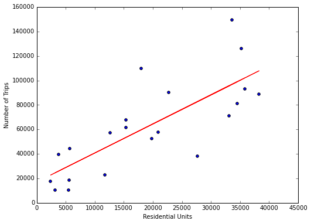
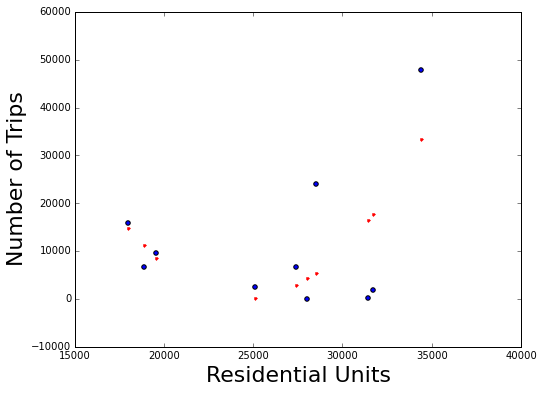
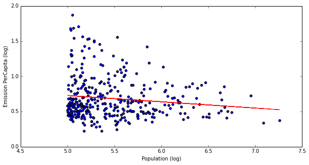
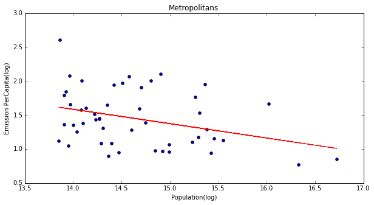

## Is number of residential units a good predictor of volumn of citibike trips? 

#### Dataset: 
Jan and August 2015 Citibike data; MapPluto of Manhattan and Brooklyn

#### Results:
Manhattan   

Brooklyn   

## Is there an optimal city size for reducing carbon emissions?

#### Dataset: 
2002 total carbon emission (unit: million tons) and population by county from ASU Vulcan Project; geographic relationship file between CBSA (used to identify cities) and county

#### Results:
All Cities  

Metropolitan   

## NYC Citibike Stations' Inflow to Outflow Trips Ratio
Collaborators: Cindy Y.Liu, Yuxiang Zhang

#### Dateset: 
We choose the August 2015 Citibike data because more people would use the citibike service during the warmer time period. 

External package: In order to run the code of geocoding reverse process, python geopy package needs to be installed.  Instruction: type 'pip install geopy' in command terminal to install.